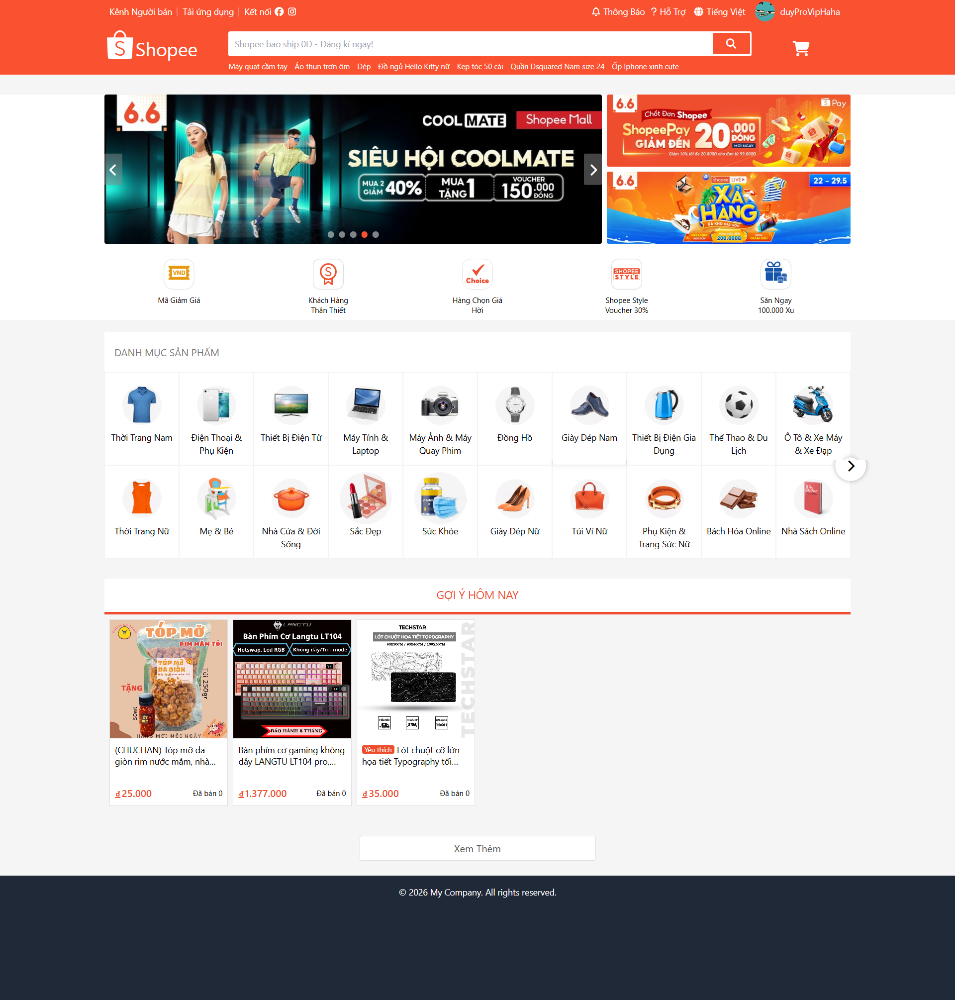
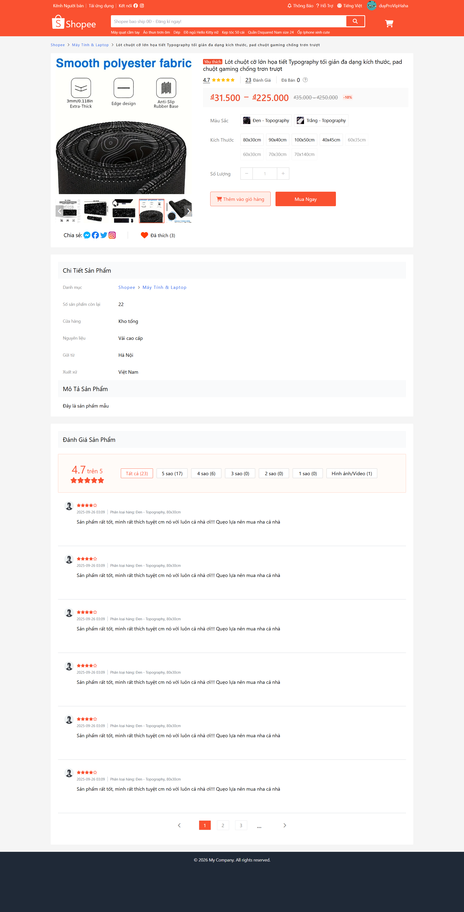
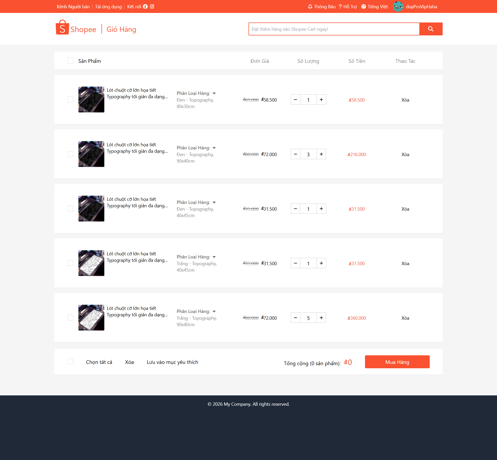
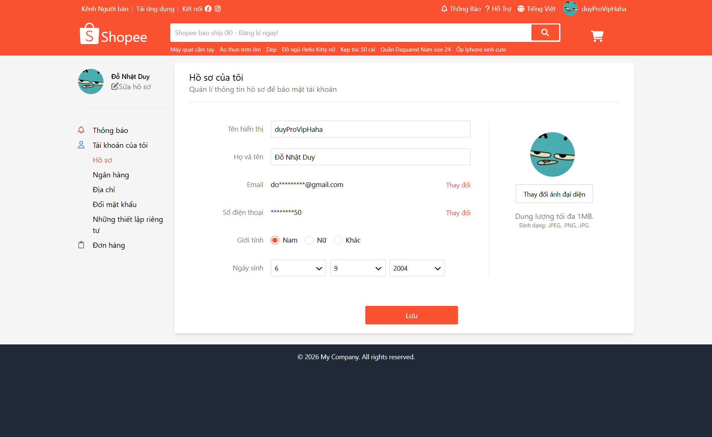
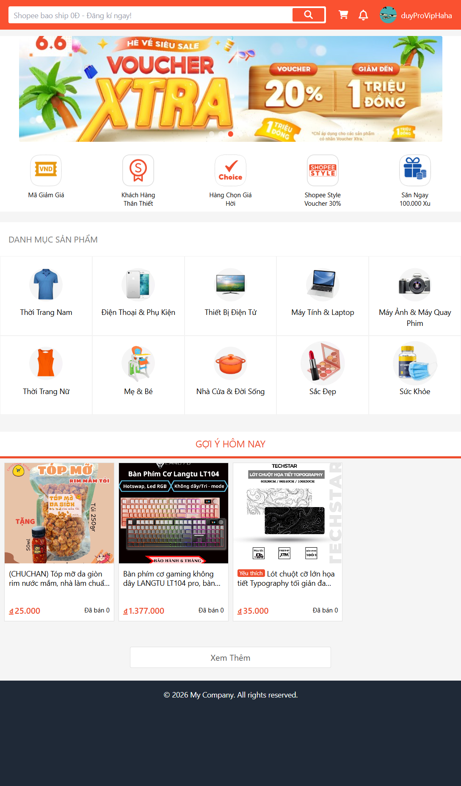
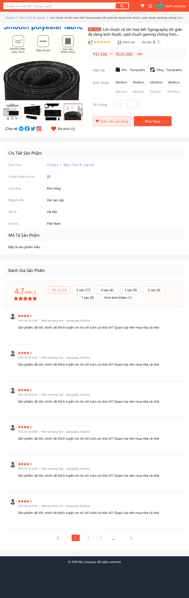
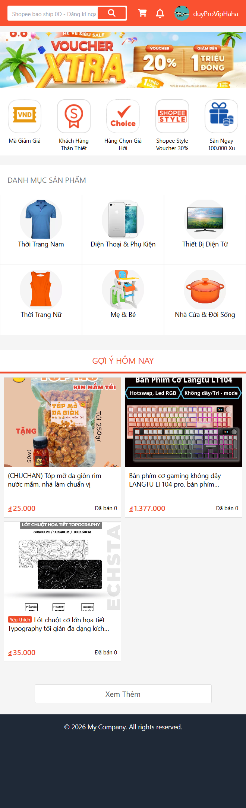
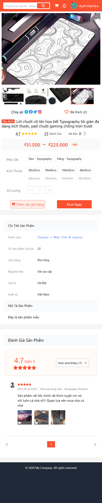
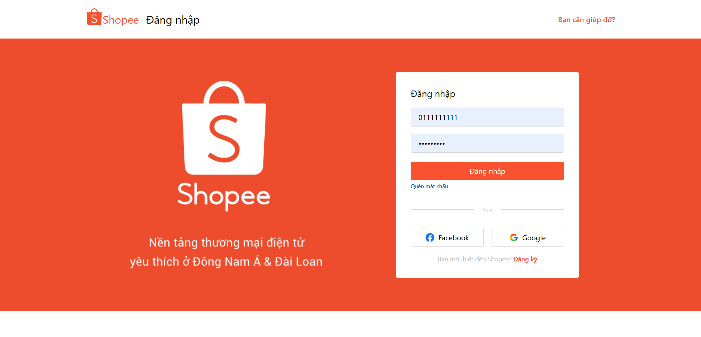

# 🛒 Shopee Clone


Dự án **Shopee Clone** được xây dựng nhằm mô phỏng các tính năng cơ bản của sàn thương mại điện tử **Shopee**. Ứng dụng full-stack gồm **Frontend (React)** và **Backend (Node.js + Express)**, kết nối với cơ sở dữ liệu **PostgreSQL MongoDB**.

---

## 🎯 Mục tiêu dự án

- Học tập và thực hành phát triển ứng dụng web full-stack
- Áp dụng các công nghệ hiện đại trong phát triển web
- Hiểu rõ kiến trúc MVC và RESTful API
- Thực hành quản lý state với Redux Toolkit
- Triển khai tính năng xác thực và phân quyền người dùng

---

## 🚀 Công nghệ sử dụng

### Frontend

- **ReactJS 19.1.0** - Library JavaScript cho giao diện người dùng
- **Redux Toolkit 2.8.2** - Quản lý state toàn cục
- **React Router DOM 7.6.0** - Điều hướng SPA
- **TailwindCSS 3.4.17** - Framework CSS utility-first
- **Axios 1.9.0** - HTTP client cho API calls
- **GSAP 3.13.0** - Thư viện animation
- **HLS.js 1.6.12** - Video streaming (HLS format)
- **React Icons 5.5.0** - Bộ icon components

### Backend

- **Node.js & Express.js 5.1.0** - Runtime và web framework
- **Sequelize 6.37.7** - ORM cho PostgreSQL
- **PostgreSQL (pg 8.16.3)** - Cơ sở dữ liệu chính - Product
- **MongoDB & Mongoose 8.15.0** - Cơ sở dữ liệu phụ - User, Cart
- **Redis** - Cơ sở dữ liệu cache, session storage
- **JWT (jsonwebtoken 9.0.2)** - Xác thực người dùng
- **Bcrypt.js 3.0.2** - Mã hóa mật khẩu
- **Google OAuth 2.0** - Đăng nhập bằng Google
- **CORS 2.8.5** - Cross-Origin Resource Sharing
- **Cookie Parser 1.4.7** - Xử lý cookies
- **Socket.io** - WebSockets cho thông báo real-time
- **Cloudinary & Multer** - Lưu trữ và quản lý hình ảnh
- **VNPay** - Cổng thanh toán trực tuyến
- **Nodemailer** - Gửi email thông báo

### Deployment, DevOps & Tools

- **Vercel** - Hosting platform cho Frontend
- **Azure VM (Ubuntu)** - Cloud server hosting Backend
- **Nginx** - Web server & Reverse proxy
- **Docker & Docker Compose** - Containerization và orchestration
- **Watchtower** - Tự động cập nhật Docker containers
- **Nodemon 3.1.10** - Auto-restart server khi development

---

## ⚡ Tính năng đã hoàn thành

### 🔐 Xác thực & Phân quyền

- [x] Đăng ký tài khoản mới
- [x] Đăng nhập với email/password
- [x] Đăng nhập với Google OAuth 2.0
- [x] JWT authentication
- [x] Middleware xác thực
- [x] Quản lý session và cookies

### 🛍️ Sản phẩm

- [x] Tìm kiếm sản phẩm tối ưu (Debounce API call)
- [x] Hiển thị danh sách phân loại và kích thước nếu có
- [x] Chi tiết sản phẩm với hình ảnh
- [x] Thông tin chi tiết sản phẩm
- [x] Tăng giảm số lượng sản phẩm
- [x] Giá tiền thay đổi tùy theo phân loại
- [x] Thông báo lỗi nếu có
- [x] Thêm sản phẩm vào giỏ hàng
- [x] Tạo sản phẩm mới lên sàn điện tử

### 🛒 Giỏ hàng

- [x] Cập nhật số lượng sản phẩm
- [x] Xóa sản phẩm khỏi giỏ hàng
- [x] Tính tổng giá trị đơn hàng
- [x] Quản lý giỏ hàng với Redux

### ⭐ Đánh giá & Review

- [x] Hiển thị danh sách đánh giá
  - [x] Hiển thị - Điểm, Nội dung, Hình ảnh, Video
  - [x] Hiển thị - Ngày, Tên, Phân loại hàng
  - [x] Thanh chứa Video và Hình ảnh
  - [x] Video - HLS Streaming - File .m3u8

### 👤 Quản lý người dùng

- [x] Profile người dùng
  - [x] Email - Vertify & Update
  - [x] Phone - Update
  - [x] Profile - Update
  - [x] Avatar - Update - Url, File Object
- [x] Thông báo (Notification)
  - [x] Hiển thị danh sách thông báo
  - [x] Tải thêm thông báo mượt mà (Infinite Scroll)
- [x] Order Dashboard
  - [x] Hiển thị đơn hàng và bộ lọc trạng thái
  - [x] Đặt hàng nhiều sản phẩm
  - [x] Thanh toán trực tuyến với VNPay
- [x] Quản lý cửa hàng (Shop)
  - [x] Đăng ký thông tin cửa hàng
  - [x] Tối ưu hóa truy xuất dữ liệu cửa hàng
  - [x] Theo dõi / Bỏ theo dõi cửa hàng

### 🎨 Giao diện & UX

- [x] Responsive design với TailwindCSS - Mobile, Ipad, PC
- [x] Loading Skeletons - Comments, Product Page, Dashboard
- [x] StackBar Notifications - In Cart, Product, User Layout - Component
- [x] Image Preview - Thanh hình ảnh & Ảnh chính - Component
- [x] Image Revealer - Chuyển hình ảnh 1 --> 2 với GSAP - Component
- [x] Carousel Slide - Hình ảnh - Responsive - Component
- [x] Carousel Slide - Danh mục - Responsive
- [x] Pagination - In review comments - Responsive - Component
- [x] Smooth animations với GSAP - Text, ImageRevealer
- [x] Scroll to top - Component
- [x] Animation đóng mở mượt mà ở [Sidebar - In User Layout], [Input File - In User Profile], [Cart, User Icon - In Header]
- [x] Spinner Button - Component
- [x] Step Progress - Linh hoạt theo --var(Steps []) - Component

---

## 🚧 Tính năng đang và sẽ phát triển

- [ ] Giao diện trang thông tin người dùng
- [ ] Quản lý đơn hàng
- [ ] Chat với người bán
- [ ] Admin dashboard

---

## 📂 Cấu trúc dự án

```
shopee-clone/
│
│   ├── 📁 backend/
│   │   ├── Dockerfile
│   │   ├── 📁 config/
│   │   │   ├── cloudinaryConfig.js
│   │   │   ├── redisConfig.js
│   │   │   └── socketConfig.js
│   │   ├── 📁 controllers/
│   │   │   ├── authController.js
│   │   │   ├── notificationController.js
│   │   │   ├── orderController.js
│   │   │   ├── ...
│   │   ├── 📁 middleware/
│   │   │   ├── authMiddleware.js
│   │   │   ├── errorHandle.js
│   │   │   └── upload.js
│   │   ├── 📁 models/
│   │   │   ├── 📁 Mongoose/
│   │   │   │   ├── Cart.js
│   │   │   │   ├── Shop.js
│   │   │   │   └── User.js
│   │   │   └── 📁 PostgreSql/
│   │   │       ├── 📁 Notification/
│   │   │       │   └── notification.model.js
│   │   │       ├── 📁 Order/
│   │   │       │   ├── order.model.js
│   │   │       │   └── order_item.model.js
│   │   │       ├── 📁 Product/
│   │   │       │   ├── attribute.model.js
│   │   │       │   ├── detail.model.js
│   │   │       │   ├── image_product.model.js
│   │   │       │   ├── like.model.js
│   │   │       │   ├── product.model.js
│   │   │       │   ├── sold.model.js
│   │   │       │   └── stock.model.js
│   │   │       ├── 📁 Rating/
│   │   │       │   ├── image.model.js
│   │   │       │   ├── rating.model.js
│   │   │       │   └── video.model.js
│   │   │       ├── 📁 Shop/
│   │   │       ├── 📁 User/
│   │   │       │   └── follower.model.js
│   │   │       └── index.js
│   │   ├── 📁 routes/
│   │   ├── 📁 services/
│   │   └── 📁 utils/
│   │       ├── appErrors.js
│   │       ├── redisHelper.js
│   │       └── responseHelper.js
│   │   ├── server.js
|   |
│   ├── 📁 frontend/
│   │   ├── 📁 src/
│   │   │   ├── App.js
│   │   │   ├── 📁 app/
│   │   │   │   └── store.js
│   │   │   ├── 📁 assets/
│   │   │   ├── 📁 components/
│   │   │   │   ├── 📁 animations/
│   │   │   │   ├── 📁 buttons/
│   │   │   │   ├── 📁 cartComponents/
│   │   │   │   ├── 📁 dropdownComponents/
│   │   │   │   ├── 📁 home/
│   │   │   │   ├── 📁 input/
│   │   │   │   ├── 📁 layout/
│   │   │   │   ├── 📁 orderComponents/
│   │   │   │   ├── 📁 others/
│   │   │   │   ├── 📁 productComponents/
│   │   │   │   ├── 📁 purchaseComponents/
│   │   │   │   ├── 📁 shopComponents/
│   │   │   │   │   └── 📁 product/
│   │   │   │   ├── 📁 sidebar/
│   │   │   │   ├── 📁 skeletons/
│   │   │   │   └── 📁 userComponents/
│   │   │   ├── 📁 config/
│   │   │   │   └── socket.config.js
│   │   │   ├── 📁 contexts/
│   │   │   │   ├── AuthInitializer.js
│   │   │   │   └── SocketInitializer.js
│   │   │   ├── 📁 css/
│   │   │   ├── 📁 features/
│   │   │   │   ├── 📁 api/
│   │   │   │   │   ├── authQuery.js
│   │   │   │   │   ├── cartQuery.js
│   │   │   │   │   ├── 📁 config/
│   │   │   │   │   │   └── cartConfig.js
│   │   │   │   │   ├── mediaQuery.js
│   │   │   │   │   ├── notificationQuery.js
│   │   │   │   │   ├── orderQuery.js
│   │   │   │   │   ├── productQuery.js
│   │   │   │   │   ├── shopProductQuery.js
│   │   │   │   │   ├── shopQuery.js
│   │   │   │   │   └── userQuery.js
│   │   │   │   ├── 📁 auth/
│   │   │   │   │   └── authSlice.js
│   │   │   │   ├── 📁 cart/
│   │   │   │   │   └── cartSlice.js
│   │   │   │   ├── 📁 notification/
│   │   │   │   │   └── notificationSlice.js
│   │   │   │   └── 📁 shop/
│   │   │   │       └── shopSlice.js
│   │   │   ├── 📁 hooks/
│   │   │   │   ├── useSocket.jsx
│   │   │   │   └── ...
│   │   │   ├── 📁 layouts/
│   │   │   │   ├── Footer.jsx
│   │   │   │   ├── 📁 Header/
│   │   │   │   │   ├── Header.jsx
│   │   │   │   │   ├── ...
│   │   │   │   ├── MainLayout.jsx
│   │   │   │   ├── ...
│   │   │   ├── 📁 pages/
│   │   │   │   ├── 📁 _auth/
│   │   │   │   │   ├── authPage.jsx
│   │   │   │   │   ├── login.jsx
│   │   │   │   │   └── register.jsx
│   │   │   │   ├── 📁 _cart/
│   │   │   │   │   └── cartPage.jsx
│   │   │   │   ├── 📁 _catagory/
│   │   │   │   │   └── categoryPage.jsx
│   │   │   │   ├── 📁 _product/
│   │   │   │   │   ├── TrendingProductLayout.jsx
│   │   │   │   │   └── productPage.jsx
│   │   │   │   ├── 📁 _profile/
│   │   │   │   │   ├── 📁 _shop/
│   │   │   │   │   │   └── shopProfile.jsx
│   │   │   │   │   └── 📁 _user/
│   │   │   │   ├── 📁 _purchase/
│   │   │   │   │   ├── purchasePage.jsx
│   │   │   │   │   └── 📁 vnpay_return/
│   │   │   │   │       └── page.jsx
│   │   │   │   ├── 📁 _shop/
│   │   │   │   │   ├── 📁 _orders/
│   │   │   │   │   ├── 📁 _products/
│   │   │   │   │   │   └── 📁 _add/
│   │   │   │   │   │       └── addProduct.jsx
│   │   │   │   │   ├── dashboard.jsx
│   │   │   │   │   ├── registerPage.jsx
│   │   │   │   │   └── shopUnknown.jsx
│   │   │   │   ├── 📁 _user/
│   │   │   │   │   ├── 📁 _account/
│   │   │   │   │   │   ├── emailVertify.jsx
│   │   │   │   │   │   ├── no-emailUpdate.jsx
│   │   │   │   │   │   ├── phoneVertify.jsx
│   │   │   │   │   │   └── userProfile.jsx
│   │   │   │   │   ├── 📁 _notification/
│   │   │   │   │   ├── 📁 _order/
│   │   │   │   │   │   └── userOrder.jsx
│   │   │   │   │   └── userUnknown.jsx
│   │   │   │   └── home.jsx
│   │   │   ├── 📁 routes/
│   │   │   ├── 📁 services/
│   │   │   └── 📁 utils/
│   │   └── tailwind.config.js
├── docker-compose.yaml
├── script.sql
├── scriptRating.sql
└── README.md
```

---

## �️ Cơ sở dữ liệu

### PostgreSQL (Chính)

- **Products**: Thông tin sản phẩm, chi tiết, thuộc tính, hình ảnh, tồn kho, lượt bán, lượt thích
- **Ratings**: Đánh giá, hình ảnh và video review
- **Orders**: Thông tin đơn hàng và chi tiết đơn hàng
- **Notifications**: Thông báo hệ thống theo thời gian thực
- **Users**: Người theo dõi (Followers)
- **Shops**: Cửa hàng (nếu có)

### MongoDB (Phụ)

- **Users**: Thông tin đăng nhập và tài khoản người dùng
- **Carts**: Giỏ hàng

### Redis (Cache)

- **Cache**: Cache dữ liệu thường xuyên truy cập

---

## �📦 Cài đặt và chạy dự án

### Yêu cầu hệ thống

- Node.js >= 16.0.0
- PostgreSQL >= 12.0
- MongoDB >= 4.4
- Redis >= 4.0
- Docker & Docker Compose (tùy chọn)
- npm >= 8.0.0

### 1. Clone repository

```bash
git clone https://github.com/22120074/shopee-clone.git
cd shopee-clone
```

### 2. Cài đặt Backend

```bash
cd backend
npm install
```

### 3. Cài đặt Frontend

```bash
cd ../frontend
npm install
```

### 4. Chạy ứng dụng

#### Development mode (Manual)

```bash
# Terminal 1: Backend
cd backend
node server.js

# Terminal 2: Frontend
cd frontend
npm start
```

#### Production mode với Docker

```bash

# Build lại images trước khi chạy
docker-compose up --build -d

# Build lại images trước khi chạy backend
docker-compose up -d --build backend
docker-compose logs -f backend

# Build lại images trước khi chạy db
docker-compose up -d --build db
docker-compose logs -f db

# Vào redis
docker exec -it my-redis redis-cli
MONITOR

# Show tiến trình docker
docker ps

# Show tiến trình db
docker exec -it shoppe-db psql -U postgres -d Shoppe_DB -c "\dt *.*"

ssh azureuser@20.197.21.221
ssh -i <path_to_key> azureuser@IP
ssh -i D:\Mon_Hoc\BE.Redis_key.pem azureuser@20.197.21.221

exit
clear

cd ~/my-app

# Để sửa file
sudo nano ...

sudo systemctl restart nginx
sudo nginx -t

```

Ngân hàng: NCB

Số thẻ:
9704198526191432198

Tên chủ thẻ:
NGUYEN VAN A

Ngày phát hành:
07/15

Mật khẩu OTP: 123456 (Nhập sau khi bấm xác nhận thanh toán)

## 🔧 Cấu hình môi trường

### Backend (.env)

```env
PORT=5000
MONGO_URI=
JWT_SECRET=
JWT_REFRESH_SECRET=
FRONTEND_URL=http://localhost:3000
GOOGLE_CLIENT_ID=
GOOGLE_CLIENT_SECRET=
REDIS_URL=
EMAIL_USER=
EMAIL_PASS=
EMAIL_PASS_APP=
```

### Frontend (.env)

```env
REACT_APP_API_URL=http://localhost:5000
HOST=localhost
PORT=3000
REACT_APP_GOOGLE_CLIENT_ID=
```

---

## 🐳 Docker Deployment

### Docker Commands:

```bash
# Khởi động tất cả services
docker-compose up -d

# Rebuild images và khởi động
docker-compose up --build -d

```

---

## 🎨 Screenshots

### 💻 Giao diện Desktop (PC)

|                Trang chủ                |                 Chi tiết sản phẩm                  |            Giỏ hàng             |               Trang cá nhân                |
| :-------------------------------------: | :------------------------------------------------: | :-----------------------------: | :----------------------------------------: |
|  |  |  |  |

### 📟 Giao diện Tablet

|                    Trang chủ                    |                     Chi tiết sản phẩm                      |
| :---------------------------------------------: | :--------------------------------------------------------: |
|  |  |

### 📱 Giao diện Mobile (Phone)

|                   Trang chủ                   |                    Chi tiết sản phẩm                     |
| :-------------------------------------------: | :------------------------------------------------------: |
|  |  |

### 🔐 Xác thực & Đăng nhập

|                      Giao diện Đăng nhập / Đăng ký                      |
| :---------------------------------------------------------------------: |
|  |

---

## 👨‍💻 Tác giả

**Sinh viên**: 22120074 - Đỗ Nhật Duy
**Repository**: [shopee-clone](https://github.com/22120074/shopee-clone)
